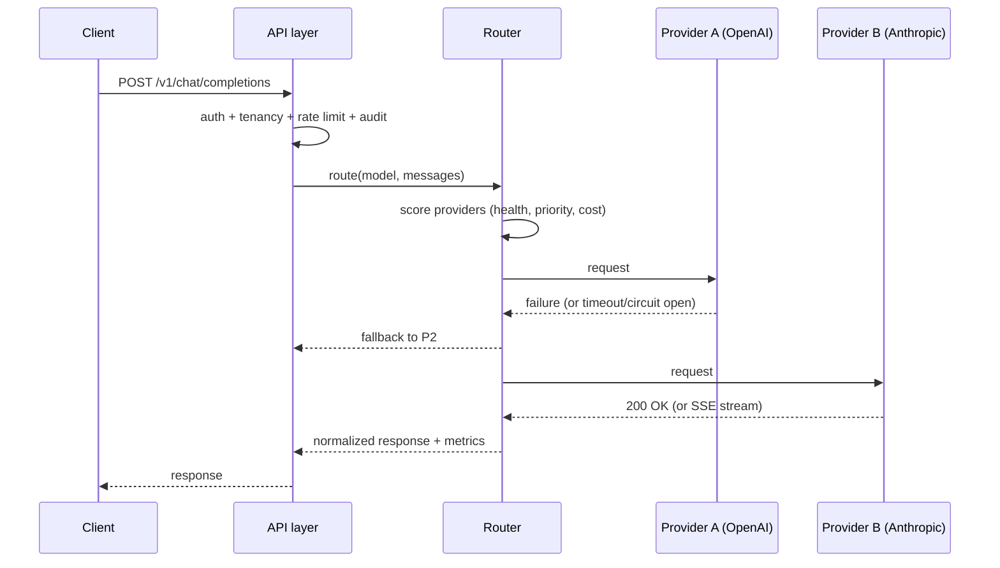
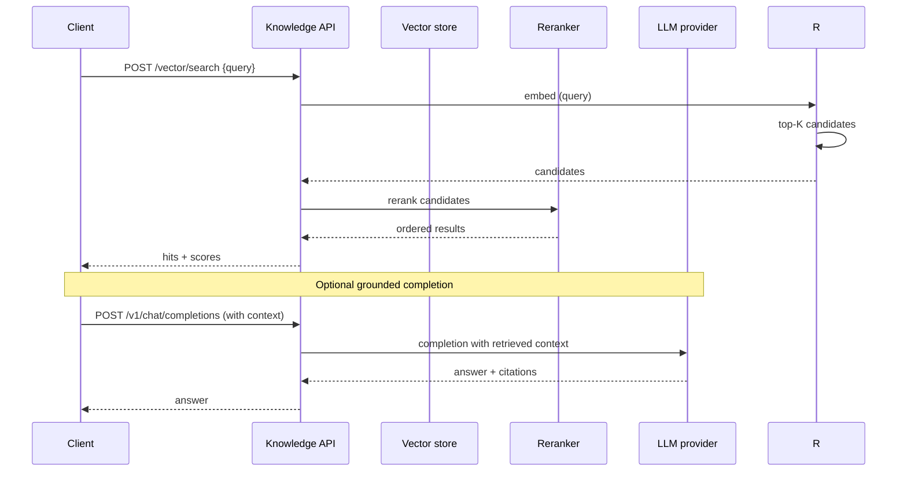
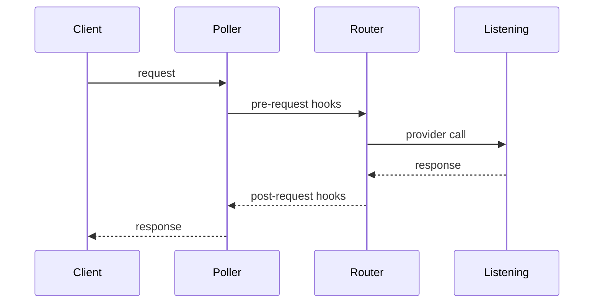
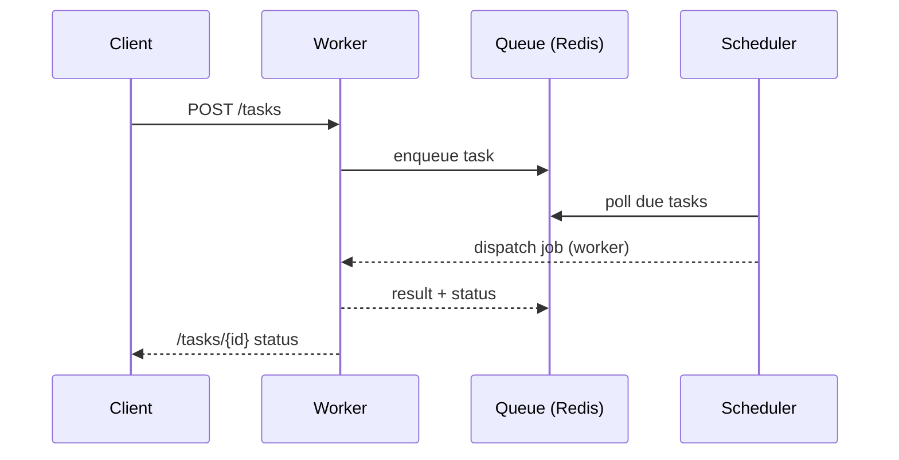
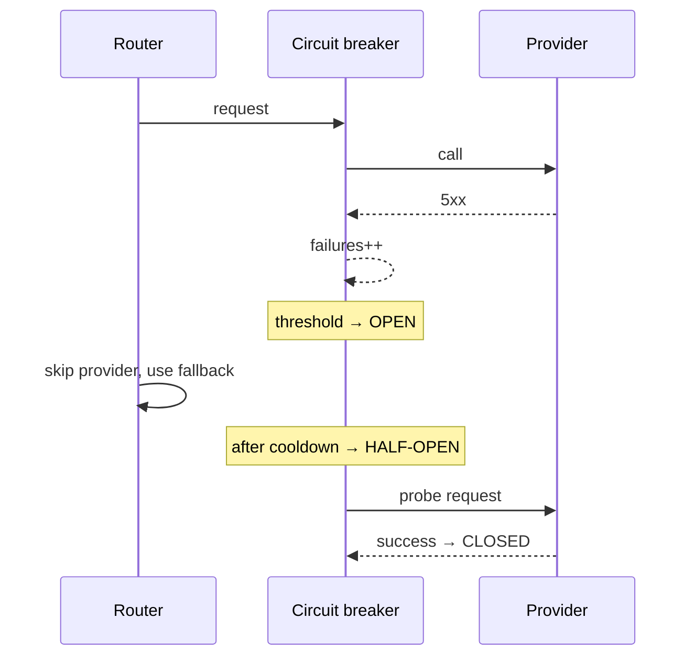

# Architecture — Sequence Diagrams

Sequence diagrams for the most important request flows. All diagrams are
text/mermaid (no images, renderable in any GitHub markdown viewer).

## 1. Chat completion with failover



## 2. RAG retrieval



## 3. Plugin request hooks



## 4. Distributed task execution



## 5. Registration with Plugins in the API layer

```mermaid
sequenceDiagram
    participant C as Client
    participant API as API layer
    participant Secret as Security
    participant Billing as Billing

    C->>API: authenticated request
    API->>API: verify signature/device (security)
    por--Interrupt? no
    API->>Billing: meter usage
    Billing-->>API: quota check
    API-->>C: response
```

## 6. Failure / recovery (circuit breaker)

